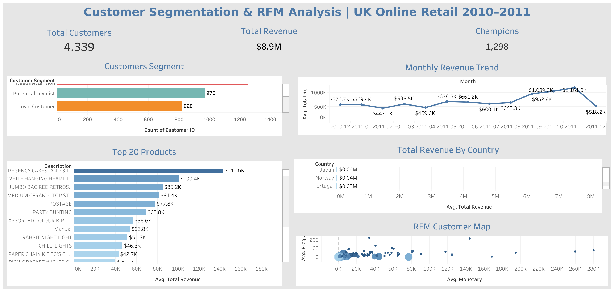

# Customer Segmentation & RFM Analysis

## 📊 [View Live Dashboard](https://public.tableau.com/views/CustomerSegmentationAnalysis_17811225283460/Dashboard1)

---

## Business Context

Not all customers are equal. A small percentage of customers typically drive the majority of revenue — yet most businesses treat every customer the same way. This project segments 4,339 customers from a UK-based online retailer using RFM analysis (Recency, Frequency, Monetary) to answer a critical business question:

> **Who are our most valuable customers — and what should we do differently for each segment?**

---

## Key Findings

- **Champions drive disproportionate value** — 1,298 customers (30% of the base) are classified as Champions, likely accounting for the majority of the $8.9M in total revenue
- **1,251 customers "Need Attention"** — the second largest segment represents a major re-engagement opportunity; these customers were once active but are showing signs of disengagement
- **The UK accounts for $7.31M of $8.9M total revenue (82%)** — heavy geographic concentration creates business risk; international expansion in Netherlands, EIRE, and Germany shows early traction
- **Revenue peaks sharply in November 2011** — a clear Black Friday/holiday season effect driving £1.16M in a single month, nearly double the average month
- **Paper Craft and Regency Cakestand are the top revenue products** at £168.5K and £142.6K respectively — gifting and home décor dominate the product mix, consistent with the holiday revenue spike

---

## Recommendations

1. **Reward Champions before they churn** — implement a VIP loyalty program for the top RFM segment; it costs far less to retain a Champion than to reacquire them
2. **Launch a win-back campaign for "Needs Attention" customers** — 1,251 customers who were once active are drifting; a targeted discount or personalized outreach campaign could recover a significant portion
3. **Reduce UK revenue concentration** — 82% dependence on one market is a business risk; Netherlands and Germany show strong revenue-per-customer ratios worth investing in
4. **Plan inventory and staffing around the November spike** — the seasonal pattern is highly predictable; operational planning around Q4 could improve margins and customer satisfaction
5. **Bundle top products for gifting season** — Paper Craft, Cakestand, and White Hanging Heart items cluster together as gifting products; seasonal bundles could increase average order value

---

## RFM Methodology

RFM is a proven customer segmentation framework used across retail, e-commerce, and subscription businesses:

| Dimension | Definition | Signal |
|---|---|---|
| Recency | Days since last purchase | How recently did they buy? |
| Frequency | Number of distinct orders | How often do they buy? |
| Monetary | Total spend | How much do they spend? |

Each customer is scored 1–4 on each dimension using quartiles (`NTILE(4)` in SQL), then combined into a total RFM score (3–12). Segments are assigned based on score combinations:

| Segment | RFM Score | Business Action |
|---|---|---|
| Champion | 10–12 | Reward, upsell, ask for reviews |
| Loyal Customer | 8–9 | Upsell, offer loyalty program |
| Potential Loyalist | 6–7 | Nurture with targeted offers |
| New Customer | High R, Low F+M | Onboard, educate, first repeat purchase |
| At Risk | Low R, High F+M | Win-back campaign, personal outreach |
| Needs Attention | Below 6 | Re-engagement or accept churn |

---

## Dataset

**Source:** [Online Retail Dataset](https://www.kaggle.com/datasets/carrie1/ecommerce-data) — Kaggle / UCI Machine Learning Repository
**Size:** 541,909 transactions, 4,339 unique customers
**Period:** December 2010 – December 2011
**Geography:** UK-based retailer selling wholesale gifts internationally

---

## Tech Stack

| Tool | Purpose |
|---|---|
| MySQL | Data storage, cleaning, RFM scoring |
| Python (Pandas) | Data import and ETL |
| Tableau Public | Interactive dashboard |

---

## SQL Analysis

Five business-driven queries power the dashboard:

| Query | Business Question |
|---|---|
| Revenue by Country | Where is our revenue coming from geographically? |
| Monthly Revenue Trend | Is the business growing? Are there seasonal patterns? |
| RFM Scoring | How do we score each customer on recency, frequency, and spend? |
| Customer Segments | Which segment does each customer belong to? |
| Top Products by Revenue | Which products drive the most revenue? |

Full queries available in the [`/sql`](/sql) folder.

---

## Dashboard Preview

---

## Author

**Jaspiar Singh**
Data Analyst | [linkedin.com/in/jaspiar](https://linkedin.com/in/jaspiar)
